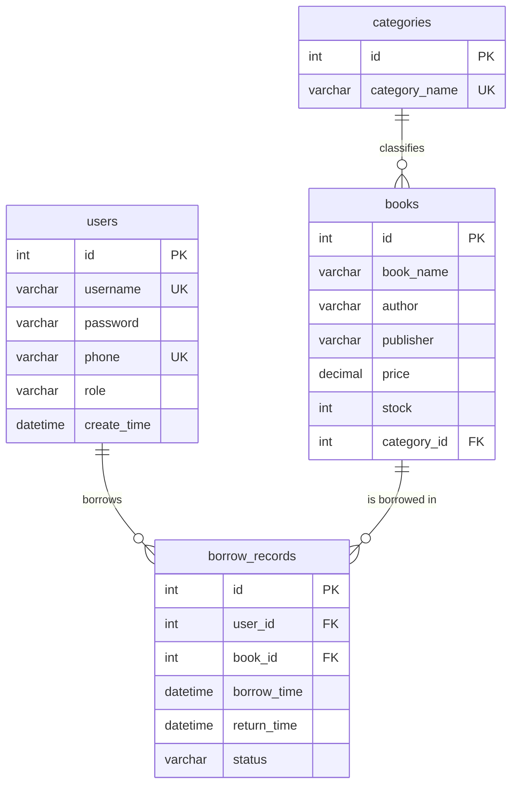

# 图书借阅管理系统（数据库课程设计）

本项目是面向大学《数据库理论与技术》课程设计的完整前后端项目，包含 React + Vite 前端、Node.js + Express 后端、MySQL 8 原生 SQL 数据库脚本。项目重点展示数据库设计、完整性约束、视图、存储过程、触发器和常见 SQL 查询能力。

## 一、技术栈

- 前端：React、Vite、Ant Design、Axios、React Router
- 后端：Node.js、Express、mysql2、CORS、dotenv
- 数据库：MySQL 8、原生 SQL（不使用 Sequelize ORM）

## 二、项目目录

```text
/client                 前端项目
  /src
    /api/http.js        Axios 封装
    /pages/Login.jsx    登录页面
    /pages/Books.jsx    图书列表、搜索、借阅
    /pages/Records.jsx  借阅记录、归还
/server                 后端项目
  /src/app.js           Express RESTful API
  /src/db.js            MySQL 连接池
/sql                    数据库脚本
  schema.sql            建库建表、完整性约束
  seed.sql              测试数据
  queries.sql           WHERE/JOIN/子查询/GROUP BY/ORDER BY 查询
  views.sql             视图
  procedures.sql        存储过程
  triggers.sql          触发器
  init.sql              一键初始化入口
```

## 三、数据库部署

### 1. 创建数据库、表、视图、存储过程、触发器和测试数据

在 `sql` 目录执行：

```bash
cd sql
mysql -uroot -p < init.sql
```

如果你的 MySQL 客户端不支持 `SOURCE` 相对路径，也可以按顺序执行：

```bash
mysql -uroot -p < schema.sql
mysql -uroot -p library_db < views.sql
mysql -uroot -p library_db < procedures.sql
mysql -uroot -p library_db < triggers.sql
mysql -uroot -p library_db < seed.sql
```

### 2. 数据库账号配置

复制后端环境变量示例文件：

```bash
cd server
cp .env.example .env
```

按你的本地 MySQL 修改 `.env`：

```env
PORT=3000
DB_HOST=localhost
DB_PORT=3306
DB_USER=root
DB_PASSWORD=123456
DB_NAME=library_db
```

## 四、启动项目

### 1. 启动后端

```bash
cd server
npm install
npm run dev
```

后端默认地址：`http://localhost:3000`

### 2. 启动前端

```bash
cd client
npm install
npm run dev
```

前端默认地址：`http://localhost:5173`

Vite 已配置 `/api` 代理到 `http://localhost:3000`，后端也配置了 CORS，因此可以自动处理前后端跨域。

## 五、演示账号

| 角色 | 用户名 | 密码 |
| --- | --- | --- |
| 管理员 | admin | 123456 |
| 学生 | student1 | 123456 |
| 学生 | student2 | 123456 |

## 六、RESTful API

| 方法 | 地址 | 功能 | 参数 |
| --- | --- | --- | --- |
| POST | `/api/login` | 登录 | `username`, `password` |
| GET | `/api/books` | 查询全部图书 | 无 |
| GET | `/api/books/search?keyword=数据库` | 搜索图书，调用存储过程 `sp_search_book` | `keyword` |
| POST | `/api/borrow` | 借阅图书 | `userId`, `bookId` |
| POST | `/api/return` | 归还图书 | `recordId` |
| GET | `/api/records?userId=2&role=student` | 查询借阅记录，基于视图 `v_borrow_detail` | `userId`, `role` |

## 七、ER 图说明



## 八、表关系说明

1. `users` 与 `borrow_records` 是一对多关系：一个用户可以产生多条借阅记录，一条借阅记录只属于一个用户。
2. `books` 与 `borrow_records` 是一对多关系：一本书可以被多次借阅，一条借阅记录只对应一本书。
3. `categories` 与 `books` 是一对多关系：一个分类下可以有多本图书，一本图书只属于一个分类。

## 九、完整性约束说明

| 表 | 约束 | 作用 |
| --- | --- | --- |
| `users.id` | PRIMARY KEY | 唯一标识用户记录，保证实体完整性。 |
| `users.username` | UNIQUE + NOT NULL | 用户名不能为空且不能重复，支持登录校验。 |
| `users.password` | NOT NULL | 密码不能为空，保证账号可认证。 |
| `users.phone` | UNIQUE | 手机号不能重复，避免用户联系方式冲突。 |
| `users.role` | CHECK | 限制角色只能是 `admin` 或 `student`。 |
| `categories.id` | PRIMARY KEY | 唯一标识分类。 |
| `categories.category_name` | UNIQUE + NOT NULL | 分类名不能为空且不能重复。 |
| `books.id` | PRIMARY KEY | 唯一标识图书。 |
| `books.book_name/author/publisher/price/stock/category_id` | NOT NULL | 图书核心信息不能为空，保证数据完整。 |
| `books(book_name, author)` | UNIQUE | 避免同一作者的同名图书重复录入。 |
| `books.price` | CHECK | 图书价格不能小于 0。 |
| `books.stock` | CHECK | 图书库存不能小于 0。 |
| `books.category_id` | FOREIGN KEY | 保证图书分类必须来自 `categories`。 |
| `borrow_records.id` | PRIMARY KEY | 唯一标识借阅记录。 |
| `borrow_records.user_id` | FOREIGN KEY + NOT NULL | 借阅记录必须关联有效用户。 |
| `borrow_records.book_id` | FOREIGN KEY + NOT NULL | 借阅记录必须关联有效图书。 |
| `borrow_records.status` | CHECK + NOT NULL | 借阅状态只能是 `BORROWED` 或 `RETURNED`。 |
| `borrow_records.return_time` | CHECK | 归还时间不能早于借阅时间。 |

## 十、视图说明

项目创建了视图 `v_borrow_detail`，用于把借阅记录、用户、图书三张表连接起来，展示：

- 记录编号
- 用户编号
- 用户名
- 图书编号
- 图书名
- 借阅时间
- 归还时间
- 状态

前端借阅记录页面和 `/api/records` 接口均使用该视图，方便课程设计验收时展示视图的实际使用。

## 十一、存储过程说明

项目创建了存储过程 `sp_search_book(IN keyword VARCHAR(100))`。

功能：根据图书名称进行模糊查询，并联表返回分类名。前端图书搜索框调用 `/api/books/search`，后端再执行：

```sql
CALL sp_search_book('数据库');
```

## 十二、触发器说明

项目创建了触发器 `trg_limit_user_borrow`。

触发时机：`BEFORE INSERT ON borrow_records`。

逻辑：当新增借阅记录的状态为 `BORROWED` 时，统计该用户当前未归还图书数量。如果数量已经大于等于 5，则通过 `SIGNAL SQLSTATE '45000'` 抛出错误，禁止继续借书。

该触发器用于展示数据库层面的业务规则控制，即使绕过前端和后端直接插入数据，也会被 MySQL 阻止。

## 十三、SQL 查询能力说明

`sql/queries.sql` 已单独整理课程要求的查询，包括：

1. WHERE 条件查询：查询库存大于 0 且分类为“数据库”的图书。
2. 多表 JOIN 查询：查询借阅详情。
3. 子查询：查询被借阅次数高于平均借阅次数的图书。
4. GROUP BY 聚合查询：按分类统计图书数量、库存和平均价格。
5. ORDER BY 排序查询：按图书价格从高到低排序。
6. 补充查询：统计当前未归还图书数量，便于验证触发器。

## 十四、课程设计验收建议

1. 先展示 `sql/schema.sql` 中的主键、外键、CHECK、UNIQUE、NOT NULL 约束。
2. 再展示 `sql/views.sql`、`sql/procedures.sql`、`sql/triggers.sql`。
3. 启动后端和前端，使用 `student1 / 123456` 登录。
4. 在图书列表搜索“数据库”，演示存储过程。
5. 点击“借阅”，观察库存减少并新增借阅记录。
6. 切换到借阅记录页，点击“归还”，观察状态变为已归还且库存恢复。
7. 使用 SQL 手工插入同一用户超过 5 条未归还记录，演示触发器拦截。
